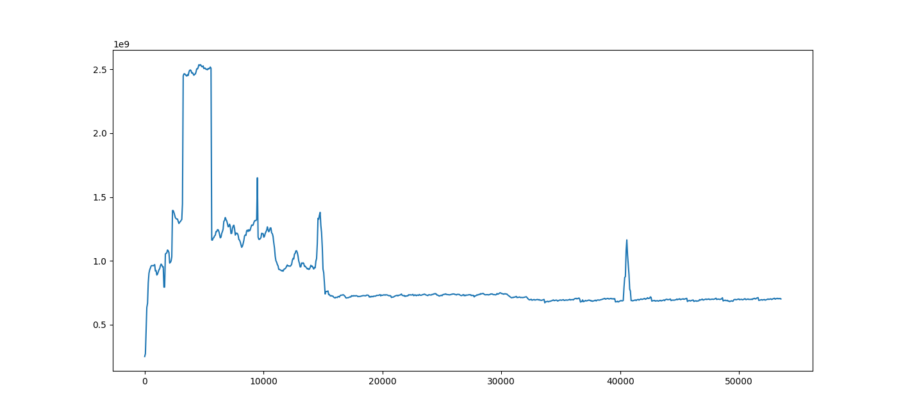
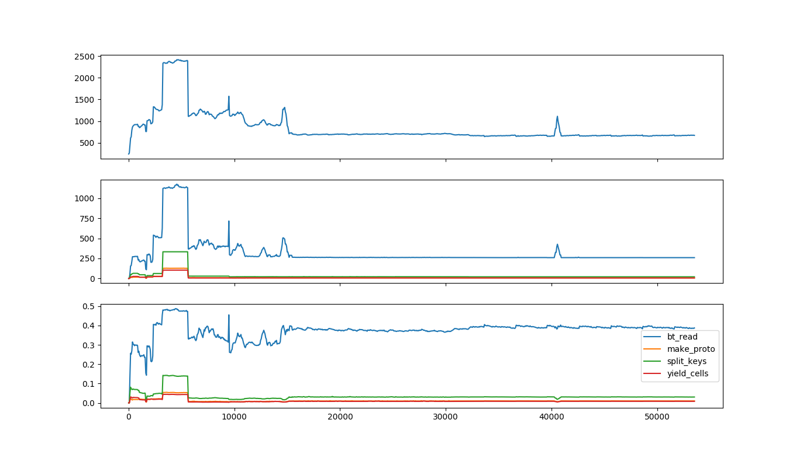

# Visualizing and interpreting results

Heap profiles think about memory in terms of stack traces: where in the execution flow the code was
when a piece of memory was allocated or freed. In heapprof, stack traces are sequences of (file
name, line number) pairs; these are the values that were correct while the code was running.
(heapprof also has "dressed" stack traces which include the text of that line of code; these are
extracted at analysis time, so they only make sense if the code hasn't changed)

Because a single line of code could be reached through many paths, a point in execution is described
by its full stack trace. This still isn't fully unique (the same code path is often run through many
times with different data!) but is a fairly good identifier.

heapprof also focuses on the lines of code at which a particular piece of memory was _allocated_. It
keeps track of when the memory was freed, but not where.

> Some possible future improvements would be to allow users to annotate stack traces (this requires
> a change to Python), or to have heapprof also track where in the code memory was freed. The second
> would have serious performance implications, so would need a clear use case to justify.

You can think of the event log (the `.hpd` file) as a sequence of events that look like (timestamp,
stack trace ID, amount of memory allocated or freed). The `.hpm` file maps stack trace ID's to
actual stack traces. The event digest (the `.hpc` file) is a sequence of snapshots, each of which is
a dict from trace ID to the amount of memory allocated there which hasn't yet been freed.

To understand where your memory is going, there are a few things you often want to look at:

* Is memory suddenly being allocated at one point in the program, or is it gradually creeping up?
* If memory usage is really high at some point in time, what's using all that memory? If it's
    growing, where did the growth come from?

heapprof has three built-in visualization tools to help with this: [time plots](#time-plots), [flow
graphs](#flow-graphs), and [flame graphs](#flame-graphs). If you need to dig deeper, the
[high-level](#the-high-level-api) and [low-level](#the-low-level-api) API's let you look at the
numbers directly.

## Time Plots

Time plots let you view memory changes over time. The simplest way to view one is

```
r = heapprof.read('filebase')
reader.timePlot().pyplot()
```

> **Note:** The `pyplot` method requires `matplotlib`. See the 
> [installation instructions](using_heapprof.md#installation-and-system-requirements) for how to
> install it if you don't already have it.

The result looks something like this:



The X-axis is time in seconds, and the Y-axis is memory in bytes. You can see in this image (and by
either looking at the returned `heapprof.Reader.TimePlot` object or using the pyplot UI) that memory
usage spiked radically at 3,240 seconds, and drops back down at 5,640 seconds. (These numbers are
multiples of 60 because the digest was created with a time resolution of 60 seconds, which is
clearly fine for a job lasting over 12 hours!)

This plot is often your first place to start analyzing, since it lets you quickly spot times at
which you want to zoom in more deeply. Later on, you might discover a few lines of code which keep
showing up as possible culprits (we'll see how to do that with flow and flame graphs); if you pass
those to `timePlot`, you can see how they compare.

```
r = heapprof.read('filebase')
reader.timePlot({
    'make_proto': '/Users/zunger/src/code/storage/impl/sba.py:406',
    'yield_cells': '/Users/zunger/src/code/storage/impl/sba.py:417',
    'split_keys': '/Users/zunger/src/code/storage/impl/split.py:57',
    'bt_read': '/Users/zunger/src/code/venv/lib/python3.7/site-packages/google/cloud/bigtable/row_data.py:483',
}).pyplot()
```

This yields a plot like this:



The top row is the same as the original time plot, showing total memory usage over time. The second
row shows the number of bytes used by each of the lines of code you selected; the bottom row shows
the fraction of all bytes used by each of the lines of code. As you can tell from the legend, the
line labeled `bt_read` is steadily about 40% of all memory usage, including during the spike, while
the line marked `split_keys` seems to have a more pronounced jump, both in total and fractional
usage.

> These are plots from real software! This was a data pipeline reading large volumes from storage.
> `bt_read` is the line in the client library that copies data from the network response into Python
> objects; `split_keys` is the line that's separating keys from wire data, while `make_proto` and
> `yield_cells` were separating out the values. This says that most of the memory is steadily in the
> buffers coming from the outside world, but during the spike, there are a lot more keys running
> around. As with any debugging, you'll need intimate knowledge of what your code is logically
> _doing_ at any step to find the issue; heapprof just points you in the right direction.

## Flow Graphs

## Flame Graphs

## The High-Level API

## The Low-Level API
