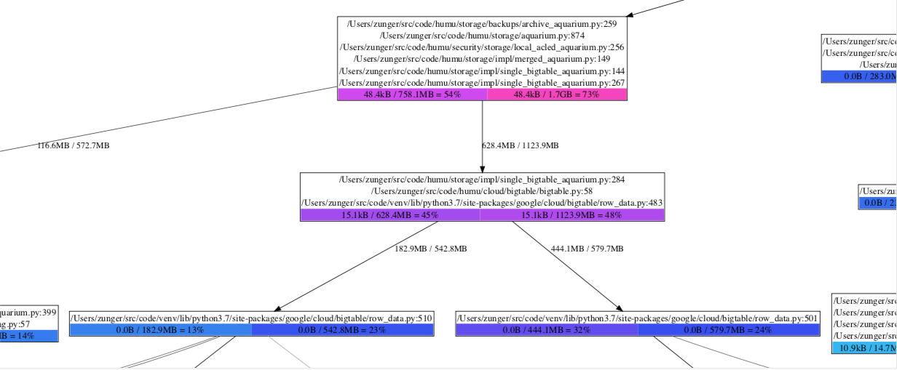
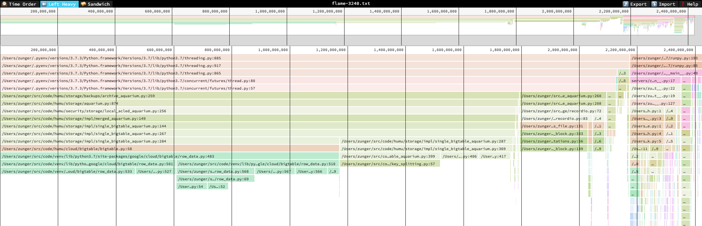

# Visualizing and interpreting results

Heap profiles think about memory in terms of stack traces: where in the execution flow the code was
when a piece of memory was allocated or freed. In heapprof, stack traces are sequences of (file
name, line number) pairs; these are the values that were correct while the code was running.
(heapprof also has "dressed" stack traces which include the text of that line of code; these are
extracted at analysis time, so they only make sense if the code hasn't changed)

Because a single line of code could be reached through many paths, a point in execution is described
by its full stack trace. This still isn't fully unique (the same code path is often run through many
times with different data!) but is a fairly good identifier.

heapprof also focuses on the lines of code at which a particular piece of memory was _allocated_. It
keeps track of when the memory was freed, but not where.

> Some possible future improvements would be to allow users to annotate stack traces (this requires
> a change to Python), or to have heapprof also track where in the code memory was freed. The second
> would have serious performance implications, so would need a clear use case to justify.

You can think of the event log (the `.hpd` file) as a sequence of events that look like (timestamp,
stack trace ID, amount of memory allocated or freed). The `.hpm` file maps stack trace ID's to
actual stack traces. The event digest (the `.hpc` file) is a sequence of snapshots, each of which is
a dict from trace ID to the amount of memory allocated there which hasn't yet been freed.

To understand where your memory is going, there are a few things you often want to look at:

* Is memory suddenly being allocated at one point in the program, or is it gradually creeping up?
* If memory usage is really high at some point in time, what's using all that memory? If it's
    growing, where did the growth come from?

heapprof has three built-in visualization tools to help with this: [time plots](#time-plots), [flow
graphs](#flow-graphs), and [flame graphs](#flame-graphs). If you need to dig deeper, the
[high-level](#the-high-level-api) and [low-level](#the-low-level-api) API's let you look at the
numbers directly.

## Time Plots

Time plots let you view memory changes over time. The simplest way to view one is

```
r = heapprof.read('filebase')
reader.timePlot().pyplot()
```

> **Note:** The `pyplot` method requires `matplotlib`. See the 
> [installation instructions](using_heapprof.md#installation-and-system-requirements) for how to
> install it if you don't already have it.

The result looks something like this:


The X-axis is time in seconds, and the Y-axis is memory in bytes. You can see in this image (and by
either looking at the returned `heapprof.Reader.TimePlot` object or using the pyplot UI) that memory
usage spiked radically at 3,240 seconds, and drops back down at 5,640 seconds. (These numbers are
multiples of 60 because the digest was created with a time resolution of 60 seconds, which is
clearly fine for a job lasting over 12 hours!)

This plot is often your first place to start analyzing, since it lets you quickly spot times at
which you want to zoom in more deeply. Later on, you might discover a few lines of code which keep
showing up as possible culprits (we'll see how to do that with flow and flame graphs); if you pass
those to `timePlot`, you can see how they compare.

```
r = heapprof.read('filebase')
reader.timePlot({
    'make_proto': '/Users/zunger/src/code/storage/impl/sba.py:406',
    'yield_cells': '/Users/zunger/src/code/storage/impl/sba.py:417',
    'split_keys': '/Users/zunger/src/code/storage/impl/split.py:57',
    'bt_read': '/Users/zunger/src/code/venv/lib/python3.7/site-packages/google/cloud/bigtable/row_data.py:483',
}).pyplot()
```

This yields a plot like this:


The top row is the same as the original time plot, showing total memory usage over time. The second
row shows the number of bytes used by each of the lines of code you selected; the bottom row shows
the fraction of all bytes used by each of the lines of code. As you can tell from the legend, the
line labeled `bt_read` is steadily about 40% of all memory usage, including during the spike, while
the line marked `split_keys` seems to have a more pronounced jump, both in total and fractional
usage.

> These are plots from real software! This was a data pipeline reading large volumes from storage.
> `bt_read` is the line in the client library that copies data from the network response into Python
> objects; `split_keys` is the line that's separating keys from wire data, while `make_proto` and
> `yield_cells` were separating out the values. This says that most of the memory is steadily in the
> buffers coming from the outside world, but during the spike, there are a lot more keys running
> around. As with any debugging, you'll need intimate knowledge of what your code is logically
> _doing_ at any step to find the issue; heapprof just points you in the right direction.

## Flow Graphs

Flow graphs are directed graphs, where each line of code is represented by a node, and each function
call is represented by an edge. The "local usage" of a node is how much memory is allocated by
that line of code; the "cumulative usage" of a node is how much memory is allocated by that line,
and everything it calls. The usage of an edge is how much memory was allocated by code paths that
went along that edge. Flow graphs can show memory usage at one or more timestamps on a single view.
From a distance, they look like this:


From close up, they look like this:



Each box has three parts:

* The sequence of lines of code. If each call to a single line leads to another single line, and no
    significant memory is being allocated by the individual lines, they're all grouped together in a
    single box; any memory that's actually being allocated is (by definition) being allocated by the
    bottommost line.
* The colored boxes at the bottom show memory counts. Each box has the form "local usage /
    cumulative usage = percent". Local usage is the amount of memory allocated by that bottommost
    line of code directly. Cumulative usage is the amount of memory allocated by that line, plus by
    any functions called by that line. Percentage is simply the cumulative usage as a percent of
    total memory usage in the program. Each box is color-coded by percentage, moving from blue
    (small usage) to red (high usage). When there are multiple boxes, this corresponds to multiple
    timestamps.
* The edges coming out of a box indicate different lines of code which could come after this line
    and are the next places where memory is allocated. The number by the edge is the amount of
    memory allocated along this path; if there are multiple numbers, they correspond to multiple
    timestamps.

So in the zoomed-in diagram, we see that `bigtable/row_data.py:483` was allocating 15.1kB of memory.
(This is a line in a client library which calls a function that processes a single chunk of data
from the network) After reaching that line, the next line of code which allocates memory is either
`row_data.py:510` or `row_data.py:501`, which are two different branches of the next function
called, that handle different possible contents of that data chunk. We see that at timestamp 1, a
total of 182.9MB was being allocated in the first path, and 444.1MB in the second; by timestamp 2,
the first one jumped to 542.8MB, while the second jumped only to 579.7MB. Looking at the next boxes,
we see that the first box jumped from light blue to dark blue, meaning that the jump to 542.8MB also
meant it now took up a much larger fraction of system memory; the second box went from purple to
dark blue, meaning that although it took up more bytes, it took up a smaller fraction of total
usage. That is, in the transition between these two timestamps, suddenly a lot more memory was being
taken up by the code path that goes through `row_data.py:510`.

A flow graph for a single timestamp can be created with

```
r = heapprof.read('filebase')
r.flowGraphAt(3800).writeDotFile('flow-3800.dot')
```

A flow graph comparing multiple timestamps can be created with

```
r.compareFlowGraphs('flow-3800-vs-4500.dot', 3800, 4500)
```

Dot files can be viewed with [graphviz](https://graphviz.org); on an OS X or UNIX system, for
example, you would do this with

```
dot -Tpdf -o flow-3800-vs-4500.pdf flow-3800-vs-4500.dot
```

The `writeDotFile` and `compareFlowGraphs` methods have various options about how the graph will be
rendered -- which lines and edges to suppress as "too small to matter," and whether the size of
nodes should be scaled based on their local usage. Local usage scaling has its pros and cons: it
lets you very quickly see where memory is being allocated, but it draws your eye to the actual line
where the allocation happens, rather than to the longer code path leading there, which is
highlighted by colors. Which setting is most useful will vary as you debug a particular situation.

## Flame Graphs

Flame graphs were originally designed to view CPU usage, but can also be used to analyze memory.
heapprof's preferred tool to view flame graphs is [speedscope](https://speedscope.app). These are
interactive objects viewed in a browser; a typical flame graph looks like this.



In this diagram, each block represents a line of a stack trace, and its width represents the
cumulative amount of memory allocated by that line or by lines that follow it. A line is stacked up
on another line if it follows it. This means that wide blocks are where most of the memory is going,
so you can quickly see where the biggest memory use is. Unlike a flow graph, however, if a single
line of code can be reached through multiple paths, each of those paths will show up as a _separate_
block on the diagram; this means that if each path contributes a little, the fact that this line is
a central hub won't be easily visible.

To help with that, from the flame graph you can flip to a "sandwich" view which looks like this:


This is simply a list of the lines of code, with cumulative ("total") and local ("self") usage
listed.

Flame graphs and flow graphs show the same information overall, but they organize it in different
ways. Flame graphs are good for quickly seeing where the largest lumps are, but they obscure the
calling paths between lines of code; flow graphs show how memory flows through the system, but don't
highlight all types of usage hotspot as vividly. You can (and should!) use both.

To create a flame graph at a single timestamp, run

```
r = heapprof.read('filebase')
r.writeFlameGraph('flame-3800.txt', 3800)
```

You can then open this file either on the [speedscope website](https://speedscope.app) or by
installing and running [speedscope](https://github.com/jlfwong/speedscope) locally. In either case,
you should use the "left heavy" or "snapshot" views; the "time order" view is specific to CPU
profiling, and produces nonsense for these flame graphs.

## API Access to Data

If you want to analyze the data in more depth than just visualizing it, you can use the `Reader` API
to directly process the digested contents of a heap profile. Your most important tools for this are:

* `Reader.snapshotAt` returns a `Snapshot` of memory usage at a given relative time. Each snapshot
    is simply a dict from trace index (a unique ID for each stack trace that shows up in the
    profile) to the number of live bytes in memory allocated by that stack trace at that time.
    A trace index of zero means "unknown trace;" this generally means that some subtle issue
    prevented the profiler from collecting a trace.
* `Reader.rawTrace` and `Reader.trace` go from a trace index to an actual stack trace. The
    difference is that a raw trace contains only file names and line numbers, while a full trace
    also fetches the actual line of code from the file, much like the traces shown in exception
    tracebacks. Full traces can only be pulled if you have the same source files locally, and at the
    same paths; thus they're generally useful if you're running the analysis on the same machine
    where you collected the heap profile.

All of the visualization functions above are built on top of this API, so you can look at their
implementation for inspiration about ways to analyze the data.

There is also a low-level API which gives you access to the underlying "raw" heap traces, before
they've been digested into snapshots. The useful one of these is `Reader.hpd`. (There are also
low-level API's to the `hpm` and `hpc` files, but they don't provide any particular value above that
of the high-level API; they're really implementation details) The `HPD` object is an iterable of
`HPDEvent` objects, which are the raw items written to disk by the profiler. Each event contains:

* `timestamp`: The timestamp when the event occurred, in seconds since the epoch. (Note that this
    is the absolute time, not the relative timestamp! You can get the global start time from the
    high-level API)
* `traceindex`: The trace index at which the corresponding piece of memory was allocated.
    (Currently, heapprof does not store the trace index at which the memory was freed)
* `size`: The number of bytes allocated or deallocated; this is positive for an allocation event,
    negative for a free event.
* `scaleFactor`: Because heapprof is a sampling heap profiler, not all events are logged. This
    number is a multiplicative scale factor which you should apply to `size` to get an estimate of
    the total number of bytes that were being allocated or freed during that time.

To go into more depth, continue on to [advanced heapprof](advanced_heapprof.md).
